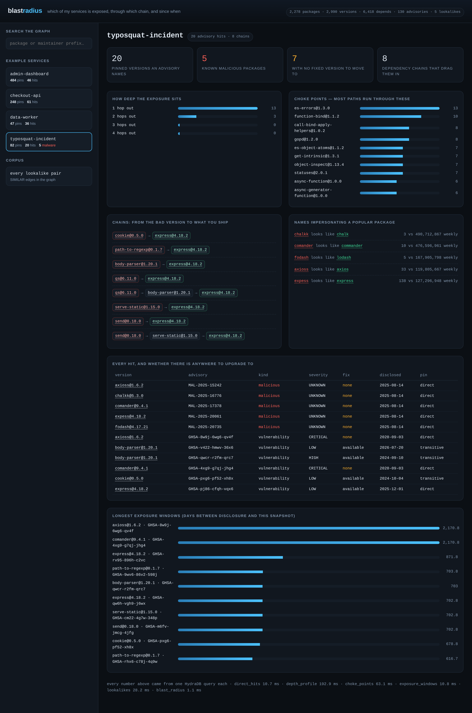
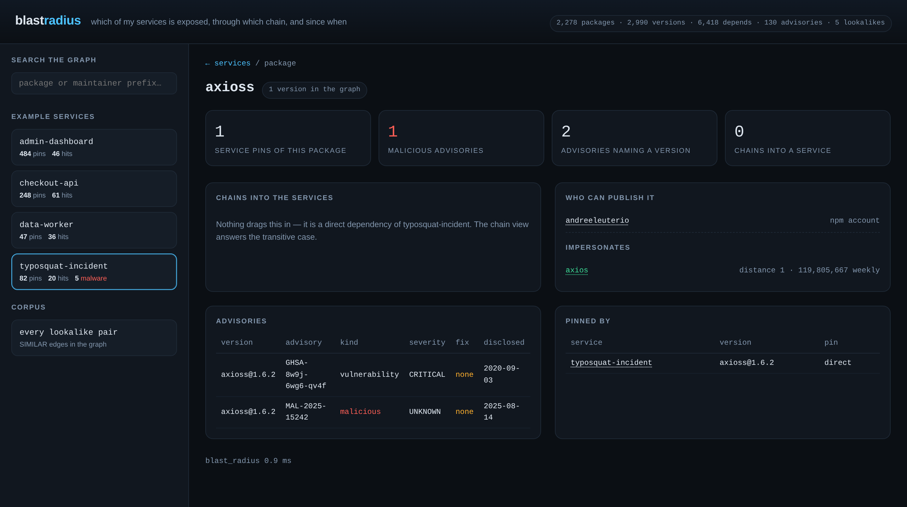
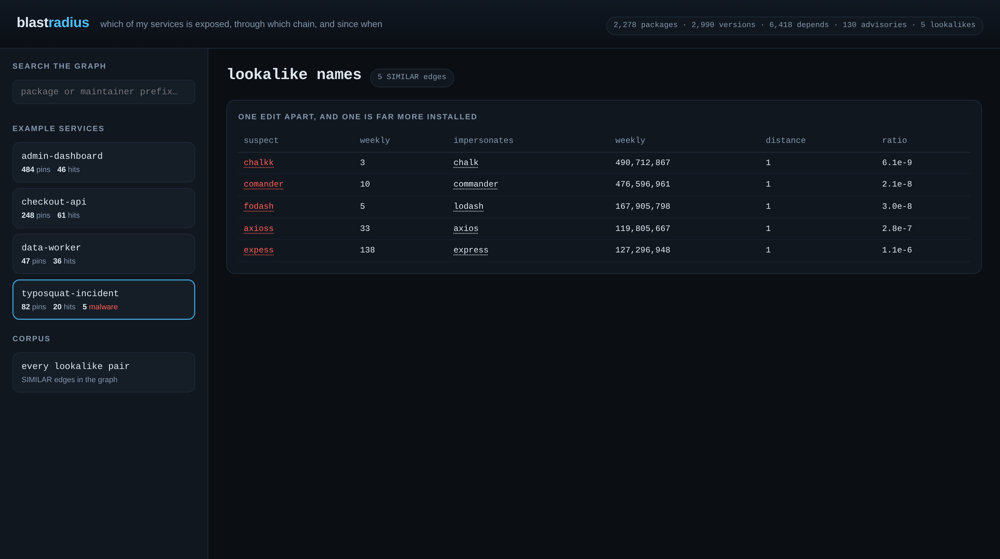

# blastradius

Answer one question fast, and answer it with evidence:

> A package was just found malicious. **Which of my services are exposed, through
> which dependency chain, and were they exposed at the moment it mattered?**

Built for Hack Hydra (Track 2 — repos, dependencies and code as graphs) on
[HydraDB](https://github.com/hydra-db/hydradb).

**Judges, in 60 seconds:** [Quickstart](#quickstart) · [How HydraDB is
used](#how-hydradb-is-used) · [The six track questions,
answered](#the-six-track-questions-answered) · [What a run actually
returns](#what-a-run-actually-returns) · [Evidence and
tests](docs/EVIDENCE.md) · [Scale evidence](#does-it-hold-up-at-scale) · [Design notes](docs/DESIGN.md)



## Why this exists

Every dependency scanner ends its report the same way: *upgrade to the fixed
version*. For the npm ecosystem that advice is now mostly fiction.

Numbers from the OSV npm dump, counted by this project's own parser. CI
re-derives them on every run into `artifacts/corpus.json`; these are from the run
of 2026-08-15, covering advisories published between 2017-10-24 and 2026-08-14:

| | count | share |
|---|---|---|
| advisories in the dump | 226,833 | 100% |
| `MAL-*` malicious-package records | 219,676 | 96.8% |
| ...of those, ones offering a fixed version | **26** | 0.01% |
| `GHSA-*` vulnerabilities | 7,157 | 3.2% |
| ...of those, ones with no fix available | 1,659 | 23% |

OSV publishes new malicious-package records daily — the day before this run the
same command counted 226,798 — so the totals move. That is why `blastradius
stats` is in the repo and runs in CI, rather than a number being pasted into this
file and quietly going stale.

When a package is malicious there is nothing to upgrade to. The only useful
questions are *what did it reach*, *how*, and *for how long* — and those are
graph questions, not table questions.

So `blastradius` does not produce a list of findings. It answers reachability:

- **Blast radius** — every service reachable from a compromised package, and the
  actual dependency chain that connects them, hop by hop.
- **Choke points** — the packages that, if compromised, would reach the most
  services. Where to spend attention *before* an incident.
- **Maintainer reach** — one account, not one package: if that account were
  taken over, how far does it get? Account takeover is how supply-chain attacks
  start.
- **Exposure window** — the days between a version being published and an
  advisory naming it. Whether you were exposed *when it mattered*, not just now.

## The graph

Six node kinds, six edge kinds. Deliberately small, because every edge has to
carry weight in a traversal:

```
(Svc)  -[:USES {direct, dev}]->      (Ver)
(Ver)  -[:DEPENDS {requirement}]->   (Ver)
(Ver)  -[:OF]->                      (Pkg)
(Maint)-[:MAINTAINS]->               (Pkg)
(Adv)  -[:AFFECTS {introduced, fixed}]-> (Ver)
(Pkg)  -[:SIMILAR {distance, downloads_ratio}]-> (Pkg)
```

`DEPENDS` comes from the submitted lockfile, resolved the way npm resolves it and
never re-resolved against today's registry. `SIMILAR` is the typosquat layer:
one edit apart, popular side over 10,000 weekly downloads, suspect side under 1%
of it — both numbers carried on the edge so the claim can be checked.
[Why, in detail →](docs/DESIGN.md)

## Quickstart

Requires Docker and Python 3.11+.

**1. Start HydraDB** (single node, local object store):

```bash
mkdir -p /tmp/hydra/store /tmp/hydra/cache
printf 'local-development-token-32-bytes' > /tmp/hydra/token   # 32 characters, see below

docker run -d --name hydradb \
  --user "$(id -u):$(id -g)" \
  -p 7687:7687 -p 8443:8443 -p 9090:9090 \
  -v /tmp/hydra:/data \
  -e CLOUD_PROVIDER=local -e LOCAL_PATH=/data/store \
  -e GRAPH_NAMESPACE=default -e GRAPH_ID=default \
  -e GRAPH_CELL_ID=cell-0 -e GRAPH_CELLS=cell-0 \
  -e GRAPH_NODE_ID=node-0 \
  -e GRAPH_BOLT_NODE_ADDRESSES=node-0=127.0.0.1:7687 \
  -e GRAPH_ADVERTISED_BOLT_ADDR=127.0.0.1:7687 \
  -e GRAPH_DATA_CACHE_DIR=/data/cache \
  -e GRAPH_AUTH_TOKEN_FILE=/data/token \
  -e GRAPH_ALLOW_PLAINTEXT=true \
  -e RUST_MIN_STACK=33554432 \
  ghcr.io/hydra-db/hydradb:0.1.1
```

The token is not decoration and its length is not arbitrary: HydraDB reads it
with `read_auth_token`, which refuses anything under 32 characters or equal to
`change-me`, and the process exits about two seconds after `docker run` has
already printed a container id. The only symptom is a port that never opens, so
`blastradius wait` checks the length before it waits and tells you to read
`docker logs hydradb` if the port stays shut.

`RUST_MIN_STACK` is not optional — the query engine recurses deeply enough to
overflow the default thread stack on real dependency graphs.

**2. Install and point it at the node:**

```bash
pip install -e .

export HYDRA_URL=http://127.0.0.1:8443
export HYDRA_ADMIN_URL=http://127.0.0.1:9090
export HYDRA_TOKEN=local-development-token-32-bytes
```

**3. Ingest and ask:**

```bash
blastradius wait                      # block until a query round-trips
blastradius selftest                  # every statement, on 11 synthetic vertices
blastradius contract                  # the failure paths: 401, wrong graph, writes that landed
blastradius ingest --seeds 40         # registry + OSV -> graph
blastradius verify --out artifacts/results.json
blastradius serve --selfcheck --dump-dir artifacts/api-samples   # drives every route
blastradius crosscheck                # those answers vs the live OSV API
blastradius incident axioss           # a package was just called malicious: the six answers
blastradius ask typosquat-incident
blastradius stats                     # ecosystem counts, no database needed
```

`selftest` takes a couple of seconds and is worth running first: it writes a
miniature graph with the production statements, runs every production query
against it, checks the answers and deletes it again, reporting each statement the
server refuses with the server's own message. It is how an unsupported query gets
found before a 219 MB download rather than after it.

`crosscheck` reads the answers `serve --selfcheck` dumped, which is why that line
comes first: it re-asks the live OSV API about a sample of them, so the run is
checked against a source that is not this project's own parser.

`ingest` downloads the OSV npm archive once (~219 MB) into `data/` and caches
every registry response under `data/cache/`, so re-runs are cheap and offline.

**4. Open the UI:**

```bash
blastradius serve                     # http://127.0.0.1:8080
```

Four views over the same graph, no build step and no extra dependency — the API
is `http.server`, the page is one HTML file:

- **service** — hits, how deep they sit, choke points, exposure windows, the
  lookalike names it ships, and every chain. Each hop in a chain is clickable.
- **package** — "this was just called malicious": which services it reaches and
  through which chains, who can publish it, what it impersonates.
- **maintainer** — if this npm account were taken over, what does it touch?
- **lookalikes** — every `SIMILAR` edge with both download counts, so a detection
  can be argued with instead of trusted.

|  |  |
|---|---|
| `axioss` — malicious, no fix, one npm account away | every lookalike pair with both download counts |

Every screenshot in `docs/screenshots/` is the real page rendered against
`artifacts/api-samples/` from a CI run — the same 2,278-package graph the numbers
below come from, not a mock-up. Search is a prefix query against the graph
(`WHERE name STARTS WITH`), not a filter in Python.

`blastradius serve --selfcheck` is what CI runs: it binds an ephemeral port,
calls every route over real HTTP and asserts on content — a service with zero
hits, a page with no chains or an empty search all fail the build. A route that
returns `200 {}` is the failure mode worth catching.

## How HydraDB is used

The point of the project is that the interesting questions are traversals, so
they are pushed into the database rather than pulled into Python.

- **`algo.MSpaths` for blast radius.** One call returns the ranked paths from a
  compromised package to every service that reaches it, with the intermediate
  hops intact — the chain *is* the answer, so a reachability boolean would not
  do. Endpoints are selected by string property (`Pkg.name`, `Maint.login`,
  `Adv.osv`), which is what the procedure's vertex-property index supports.
- **Cypher for the rest.** Direct hits, depth profile, choke points, maintainer
  footprint and exposure windows are aggregations over the same graph.
- **Search as a query, not a scan.** A pattern can carry an inline non-id
  property and `WHERE` supports `STARTS WITH` (but not `CONTAINS` or `IN`), so
  package and maintainer prefix search happen in the database, with `LIMIT` taken
  as a parameter.
- **Bulk writes via `UNWIND $rows`.** Ingest sends nested-JSON parameter batches
  over the HTTP query endpoint, upserting with `MERGE` by id then `SET`, vertices
  before edges. Batches are the only multi-row write there is: outside an
  `UNWIND`, a `MERGE` cannot be followed by any clause at all, so every statement
  in `model.py` is a batch. Chunks are bounded by row count *and* by serialised
  size, because the server caps a request body at 1 MiB.
- **Stable 62-bit ids** (blake2b, 4-bit kind tag per label) so an ingest is
  idempotent and re-runnable without duplicating nodes.
- **Cursor-aware reads.** The client follows `next_cursor` so result sets larger
  than one page are complete rather than silently truncated.

Written against the server's own source, not against assumptions: variable-length
hop bounds are formatted as range-checked integer literals because the parser
resolves them against an empty parameter map, and the traversal ceiling matches
the server default of 16 hops. Two server-enforced rules — `MERGE` on `id` alone,
and no null property values anywhere — shaped the schema itself.
[Detail →](docs/DESIGN.md)

## The six track questions, answered

`blastradius incident <package>` answers all six from the same graph, reading it
from the compromised name outwards — the direction the question actually arrives
in, and the opposite of every other command here:

```
$ blastradius incident axioss
```

| # | The question | Where the answer comes from |
|---|---|---|
| 1 | Which internal services are transitively exposed? | the `USES` edges to that exact pinned version — a lockfile is the fully resolved tree, so this cannot miss a service — plus the shortest chain up to a dependency the service actually chose |
| 2 | Which version of the dependency introduced the vulnerability? | the `introduced`/`fixed` boundaries carried on the `AFFECTS` edge, with the publication date of the first affected release |
| 3 | Which applications resolved the compromised version while it was live? | each lockfile's own snapshot date against the window between the bad release and its fix |
| 4 | Which other packages share maintainers or infrastructure with it? | `MAINTAINS`, in one traversal — a relationship that does not exist in a lockfile at all |
| 5 | Are there likely typosquat packages nearby? | `SIMILAR`, read in both directions: this name impersonating another, and others impersonating it |
| 6 | What is the complete blast radius? | every chain from a bad version to something deployed, via the native path procedures |

Each answer records the statements it ran and how long they took, and the whole
report is written to `artifacts/incident-*.json` by CI, so "this takes seconds"
is a measurement rather than a claim.

Where the graph cannot support an answer it says so: a fixed version missing from
the graph gives `unknown: fixed version not in graph`, not a confident verdict;
a pinned version no chain explains inside the hop limit is reported as
unexplained rather than quietly called a direct dependency; and every truncated
list is marked truncated. [Why questions 1 and 3 are the hard
ones →](docs/DESIGN.md)

## What a run actually returns

Every number below was read out of `artifacts/results.json` and
`artifacts/ingest.json` of one CI run (2026-08-15), not written by hand. The
advisory counts move every day; the graph counts do not, because the seeds are
pinned. 134 seed packages expand into the graph the four example services
(`checkout-api`, `admin-dashboard`, `data-worker`, `typosquat-incident` — see
[design notes](docs/DESIGN.md)) are measured against:

| | count |
|---|---|
| packages / versions | 2,278 / 2,990 |
| maintainer accounts | 1,036 |
| advisories kept (of 226,833 scanned) | 130 |
| `DEPENDS` / `USES` / `MAINTAINS` edges | 6,418 / 861 / 5,280 |
| `AFFECTS` / `SIMILAR` edges | 180 / 5 |

Per service — pinned versions an advisory names, how many of those are malware,
how many have no fixed version at all, and how many distinct dependency chains
lead to them:

| service | hits | malicious | unfixable | chains | worst exposure (days) |
|---|---|---|---|---|---|
| `checkout-api` | 61 | 0 | 0 | 16 | 2,853.5 |
| `admin-dashboard` | 46 | 0 | 1 | 12 | 2,322.9 |
| `data-worker` | 36 | 0 | 0 | 3 | 2,159.6 |
| `typosquat-incident` | 20 | 5 | 7 | 8 | 2,167.5 |

The chains are the product, so here are three verbatim:

```
elliptic@6.6.1 -> browserify-sign@4.2.6 -> crypto-browserify@3.12.1 -> node-libs-browser@2.2.1 -> webpack@4.43.0
minimist@1.2.0 -> mkdirp@0.5.6 -> tar@4.4.10
follow-redirects@1.15.11 -> axios@0.21.1
```

Choke points rank by how many paths run through them, which is why they are worth
pre-emptive attention: `es-errors@1.3.0` carries 71 paths in `checkout-api`,
`inherits@2.0.4` 53 in `admin-dashboard` — small packages nobody chose, sitting
under everything.

Typosquat detection on the same run produced five `SIMILAR` edges over 2,278
packages — the five real malicious names, and nothing else:

| suspect | weekly downloads | impersonates | weekly downloads | ratio |
|---|---|---|---|---|
| `axioss` | 33 | `axios` | 119,805,667 | 2.8e-07 |
| `chalkk` | 3 | `chalk` | 490,712,867 | 6.1e-09 |
| `comander` | 10 | `commander` | 476,596,961 | 2.1e-08 |
| `expess` | 138 | `express` | 127,296,948 | 1.1e-06 |
| `fodash` | 5 | `lodash` | 167,905,798 | 3.0e-08 |

Query latency on that graph, worst case across the four services in that run —
these move with whatever else the shared CI runner is doing, so treat them as an
order of magnitude, not a benchmark: depth profile 3,163 ms, choke points
1,119 ms, lookalikes 488 ms, blast-radius paths 108 ms, direct hits 184 ms,
exposure windows 100 ms. Ingest wrote 22,172 rows in 7.4 s; the 226,833-advisory
dump was parsed in 12.5 s; `selftest` put all 25 checks against a live node in
0.16 s, `contract` ran its 14 checks in 7.1 s, `crosscheck` re-asked the live OSV
API about 24 findings and agreed on all 24 it could compare, and
`serve --selfcheck` drove all 23 API checks over HTTP against the same graph.

## Does it hold up at scale?

Yes — measured, not claimed. CI run
[31918763850](https://github.com/berseru/blastradius/actions/runs/31918763850)
ran the whole pipeline three times against a **fresh** HydraDB store, on a seed
list where each level is a prefix of the next, so every level is the same
workload, just bigger.

| seeds | packages | versions | nodes | edges | ingest (s) | direct_hits | depth_profile | choke_points | exposure_windows | lookalikes | blast_radius |
|---:|---:|---:|---:|---:|---:|---:|---:|---:|---:|---:|---:|
| 143 | 2,389 | 3,113 | 6,705 | 16,264 | 1,289 | 42 ms | 883 ms | 326 ms | 26 ms | 90 ms | 25 ms |
| 300 | 4,265 | 5,606 | 11,898 | 31,201 | 1,830 | 54 ms | 1,208 ms | 455 ms | 30 ms | 124 ms | 35 ms |
| 600 | 5,867 | 7,869 | 16,412 | 44,219 | 1,669 | 87 ms | 962 ms | 363 ms | 23 ms | 130 ms | 38 ms |

Query times are medians across the four services, measured as round-trip time to
the database. From 143 to 600 seeds the graph grew **2.5x** in package versions
and **2.7x** in edges, while the slowest query grew **1.1x** — the traversals are
bounded by the answer, not by the size of the store. 0 query failures at every
level. Ingest time is dominated by polite, rate-limited fetching from npm and
deps.dev (fetch 1,275 s of the 1,289 s at level 143); the writes themselves took
2.0 s.

Reproduce it: run the `ci` workflow with `scale = true` (inputs `scale_levels`,
`seed_packages`); `ci/scale.sh` and `ci/scale_report.py` regenerate
`artifacts/scale/SCALE.md` and `summary.json`, which are uploaded as run
artifacts.

## Reproducing the numbers, and how it is tested

Nothing in this README is hand-counted. `blastradius verify` runs every query
against a live node and writes `artifacts/results.json`; CI publishes that file
as a build artifact on every push, alongside the container logs of the HydraDB
node it ran against. The ecosystem counts come from `blastradius stats`, which
parses the dump in ~13s into `artifacts/corpus.json`.

```bash
pip install -e ".[dev]"   # the Quickstart's plain `pip install -e .` is enough to
                          # run the tool; the tests and the linter live in [dev]
ruff check src tests ci scripts
pytest tests/unit -q
```

CI then starts a real HydraDB node in Docker and runs `selftest`, `contract`, the
ingest, the traversals, the API self-check and the OSV crosscheck against it.
The full account — the contract checks, what happens when a source is
unreachable, and how the answers are checked against a second source — is in
**[docs/EVIDENCE.md](docs/EVIDENCE.md)**.

## Data sources and attribution

- **[OSV](https://osv.dev)** — advisory data, npm dump
  (`osv-vulnerabilities.storage.googleapis.com/npm/all.zip`), CC-BY-4.0.
- **[npm registry](https://registry.npmjs.org)** — package metadata, version
  publication times, maintainer accounts.
- **[deps.dev](https://deps.dev)** — resolved dependency graphs used to build the
  example lockfiles.
- **[npm downloads API](https://api.npmjs.org/downloads/point/last-week)** —
  weekly download counts, the popularity side of the typosquat signal.
- **[HydraDB](https://github.com/hydra-db/hydradb)** — the graph database,
  AGPL-3.0, used unmodified as a container image.

Python dependencies: `httpx` (HTTP), `node-semver` (npm-accurate version range
matching), `pytest` (dev only). No other runtime dependencies.

## AI assistance

This project was built with the help of AI coding agents, under human direction
and review. Design decisions, the schema, the evidence discipline above and every
merge were reviewed by the author, and every claim in this repository is backed
by a test or a CI artifact rather than by a model's assertion.

## Licence

[Apache-2.0](LICENSE).
